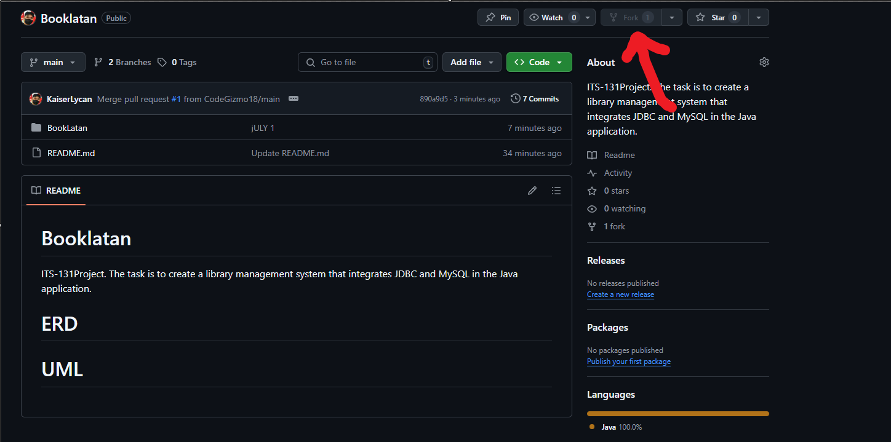

1. Go to the BookLatan repository: https://github.com/KaiserLycan/Booklatan
2. Create a `fork`, this will create a copy of the repository under your account.

3. Go to your account `settings`, then go to `developer setting`
![[Pasted image 20250701120125.png]]
![[Pasted image 20250701120202.png]]
4. Create a classic token.
	- For the description you can use anything.
	- For the check box select:
		- repositories
		- users
		- codespace
		- copilot
	- Copy the key/token and save it in a note or a .txt file for later use.
5. Head back to your repository. Click `code` and copy the URL.
![[Pasted image 20250701120537.png]]
6. Open ApacheNetbeans.
7. Click on the `team`
![[Pasted image 20250701120757.png]]
8. Go to `git` then select `clone`
9. Paste your URL in the `Repository URL`.
10. Use any name for the `User`.
11. For the `password`, use your generated token.
12. Select the physical location of the file on the device.
![[Pasted image 20250701121122.png]]
13. Select next. 
14. Select which branch you are going to copy. In your case it would be the `main`
![[Pasted image 20250701121158.png]]
15. Click `next` until the `finish` button lights up. Then click `finish`.

>[!note] Congrats!
>You may now start coding the repository.

